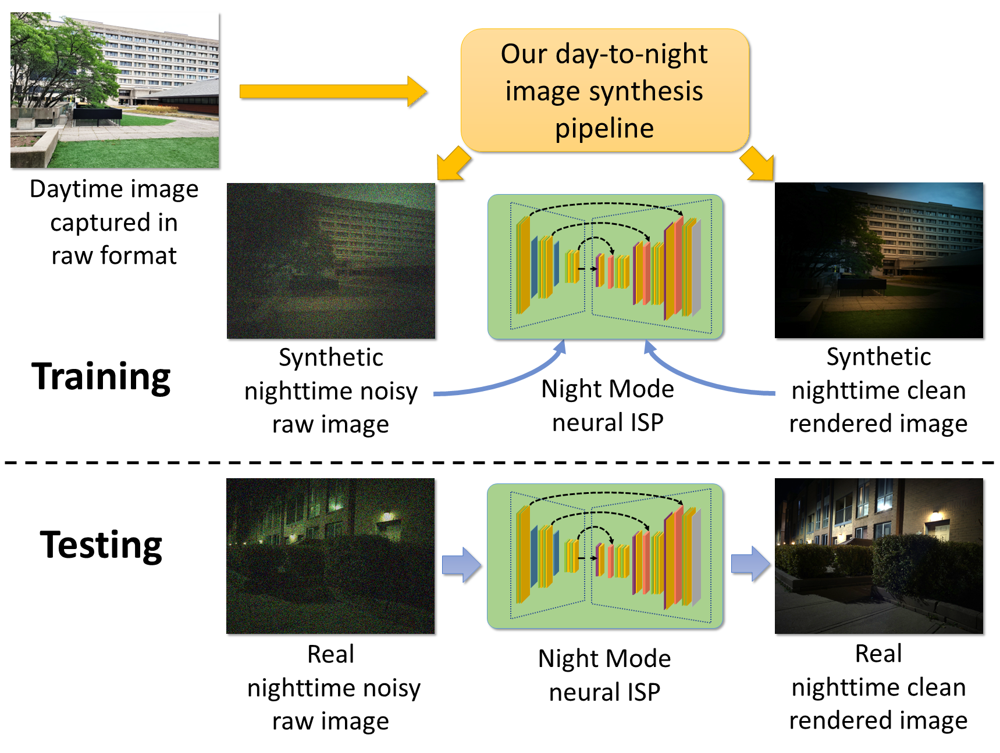

### Official repository for the paper

# Day-to-Night Image Synthesis for Training Nighttime Neural ISPs @CVPR'22 Oral 
#### Abhijith Punnappurath, Abdullah Abuolaim, Abdelrahman Abdelhamed, Alex Levinshtein, and Michael S. Brown

### Samsung Artificial Intelligence Center, Toronto, Canada
### [[Paper]](https://openaccess.thecvf.com/content/CVPR2022/papers/Punnappurath_Day-to-Night_Image_Synthesis_for_Training_Nighttime_Neural_ISPs_CVPR_2022_paper.pdf) [[arXiv]](https://arxiv.org/abs/2206.02715) [[Supplemental]](https://openaccess.thecvf.com/content/CVPR2022/supplemental/Punnappurath_Day-to-Night_Image_Synthesis_CVPR_2022_supplemental.pdf) [[Samsung Reserach blog post]](https://research.samsung.com/blog/CVPR-2022-Series-2-Day-to-Night-Image-Synthesis-for-Training-Nighttime-Neural-ISPs#none) 




### Citation

If you use this code or the associated data, please cite the paper:

```
@InProceedings{Punnappurath_2022_CVPR,
author = {Punnappurath, Abhijith and Abuolaim, Abdullah and Abdelhamed, Abdelrahman and Levinshtein, Alex and Brown, Michael S.},
title = {Day-to-night Image Synthesis for Training Nighttime Neural ISPs},
booktitle = {Proceedings of the IEEE/CVF Conference on Computer Vision and Pattern Recognition (CVPR)},
year = {2022},
}
```


### Note
- Results may differ slightly from the numbers reported in the paper because a few images from our original dataset had to be changed due to possible copyright issues. The dataset released here has the same number of images as the original dataset used in the paper; only a small number of images have been replaced.


### Get started
- The code was tested on Ubuntu 16.04, Python3.7, CUDA 10.1, cuDNN 8.0, Pytorch 1.7.0
- The code may work in other environments
- Requirements
  - opencv-python 
  - scipy 
  - exifread 
  - rawpy 
  - colour_demosaicing 
  - matplotlib 
  - tensorboard 
  - scikit-image==0.15.0 
- Download the dataset [[link]](https://ln5.sync.com/dl/ad8546d50#2atz8rpn-gjq5s8dq-u2revfvg-q2egqetr), and copy to `./dataset/` 
- (Optional) Download pre-trained models [[link]](https://ln5.sync.com/dl/aaba12730#hwyf4g96-ibtjtpid-qsr5rdzt-nvkz2tas), and copy to `./models/`


### Convert day images to synthetic nighttime images
- `python3 prepare_data.py --savefoldername night --dim --relight --relight_local`
- Synthetic nighttime images will be saved to `synthetic_datasets/night`
- Note: While synthesizing our nighttime images, we have also added a few *saturated lights* to mimic light bulbs in nighttime scenes (see the parameter `num_sat_lights` in `prepare_data.py`). Although not mentioned in our paper, we found that adding saturated lights yeilds slightly improved performance
- If you wish to skip generating the images, you can download our pre-generated data [[link]](https://ln5.sync.com/dl/e6db40570#hdqmmykq-fy5bwe4k-8tjsbf53-zxq34ff5), and copy to `./synthetic_datasets/night`


### Train Night Mode ISP on synthetic nighttime images
- Clean inputs (Table 1 of the paper)
  - `python3 train.py --data-dir synthetic_datasets/night --which-input clean_raw --wb-illum avg --savefoldername night_clean_raw --on-cuda`
- Noisy inputs (Table 2 of the paper)
  - `python3 train.py --data-dir synthetic_datasets/night --which-input noisy_raw --wb-illum avg --savefoldername night_noisy_raw --on-cuda`


### Test the synthetic nighttime data model
- Clean inputs (Table 1 of the paper)
  - `python3 test.py --model_dir night_clean_raw --set_names iso_50`
- Noisy inputs (Table 2 of the paper)
  - `python3 test.py --model_dir night_noisy_raw --set_names iso_1600,iso_3200`


### Test using our pretrained synthetic nighttime data model
- Clean inputs (Table 1 of the paper)
  - `python3 test.py --model_dir pretrained_night_clean_raw --set_names iso_50`
- Noisy inputs (Table 2 of the paper)
  - `python3 test.py --model_dir pretrained_night_noisy_raw --set_names iso_1600,iso_3200`

| Model     | PSNR (dB)      | SSIM (dB)     |
| --------- | -------------- | ------------- |
| Clean raw ISO 50   | 45.97 | 0.9924        |
| Noisy raw ISO 1600 | 37.00 | 0.9288        |
| Noisy raw ISO 3200 | 36.14 | 0.9182        |


### Train and test Night Mode ISP on real data
- Results in last row of Table 1 and Table 2 of the paper
- Uses 3-fold cross validation
- Three separate models have to be trained
- Clean inputs (Table 1 of the paper)
  - `python3 k_fold_split_data.py --which_fold 0 --with_noise 0` 
  - `python3 train.py --which-input clean_raw --savefoldername real_clean_raw_fold0 --on-cuda`
  - `python3 test.py --set_dir data/test --model_dir real_clean_raw_fold0 --set_names iso_50`
- Noisy inputs (Table 2 of the paper)
  - `python3 k_fold_split_data.py --which_fold 0 --with_noise 1` 
  - `python3 train.py --which-input noisy_raw --savefoldername real_noisy_raw_fold0 --on-cuda`
  - `python3 test.py --set_dir data/test --model_dir real_noisy_raw_fold0 --set_names iso_1600,iso_3200`
- Repeat for folds 1 and 2 


### Test using our pretrained real data model
- Clean inputs (Table 1 of the paper)
  - `python3 k_fold_split_data.py --which_fold 0 --with_noise 0` 
  - `python3 test.py --set_dir data/test --model_dir pretrained_real_clean_raw_fold0 --set_names iso_50`
- Noisy inputs (Table 2 of the paper)
  - `python3 k_fold_split_data.py --which_fold 0 --with_noise 1` 
  - `python3 test.py --set_dir data/test --model_dir pretrained_real_noisy_raw_fold0 --set_names iso_1600,iso_3200`
- Repeat for folds 1 and 2

Results averaged over 3 folds
| Model     | PSNR (dB)      | SSIM (dB)     |
| --------- | -------------- | ------------- |
| Clean raw ISO 50   | 46.66 | 0.9923        |
| Noisy raw ISO 1600 | 39.25 | 0.9511        |
| Noisy raw ISO 3200 | 38.14 | 0.9406        |


### Baseline models `day`, `day_dimmed`, and `global_relight`
#### Generate data
- `day`
  - `python3 prepare_data.py --savefoldername day`
- `day_dimmed`
  - `python3 prepare_data.py --savefoldername day_dimmed --dim`
- `global_relight`
  - `python3 prepare_data.py --savefoldername global_relight --dim --relight`
- Choose `<baseline_model_name>` below as `day`, `day_dimmed`, or `global_relight`


#### Train and test
- Clean inputs
  - `python3 train.py --data-dir synthetic_datasets/<baseline_model_name> --which-input clean_raw --savefoldername <baseline_model_name>_clean_raw --on-cuda`
  - `python3 test.py --model_dir <baseline_model_name>_clean_raw --set_names iso_50`
- Noisy inputs
  - `python3 train.py --data-dir synthetic_datasets/<baseline_model_name> --which-input noisy_raw --savefoldername <baseline_model_name>_noisy_raw --on-cuda`
  - `python3 test.py --model_dir <baseline_model_name>_noisy_raw --set_names iso_1600,iso_3200`


### Mixing synthetic and real data
- Uses 3-fold cross validation
- Three separate models have to be trained
- Clean inputs
  - `python3 k_fold_split_data.py --which_fold 0 --with_noise 0` 
  - `python3 mix_synth_real_data.py --real_percent 10`
  - `python3 train.py --which-input clean_raw --savefoldername mix_clean_raw_fold0_percent10 --on-cuda`
  - `python3 test.py --set_dir data/test --model_dir mix_clean_raw_fold0_percent10 --set_names iso_50`
- Noisy inputs
  - `python3 k_fold_split_data.py --which_fold 0 --with_noise 1` 
  - `python3 mix_synth_real_data.py --real_percent 10`
  - `python3 train.py --which-input noisy_raw --savefoldername mix_noisy_raw_fold0_percent10 --on-cuda`
  - `python3 test.py --set_dir data/test --model_dir mix_noisy_raw_fold0_percent10 --set_names iso_1600,iso_3200`
- Repeat for folds 1 and 2 


### (Optional) Full burst dataset:
- Our full burst dataset, containing 30 frames at ISO 50, and 10 frames at ISOs 1600 and 3200, can be downloaded here [[link]](https://ln5.sync.com/dl/c53cd4150#cstvvksj-bp6s2egf-97t4snxn-hy8ahpd4) 
- Downloading this dataset is NOT required to reproduce the experiments performed in the paper
- As mentioned in the paper, the bursts can be useful for denoising and other tasks. Please cite our work if you use our dataset
- The real nighttime dataset used for the above experiments can be generated from the full burst dataset by running `python3 generate_real_gt.py`


### Contact

[Abhijith Punnappurath](https://abhijithpunnappurath.github.io/) - [(abhijith.p@samsung.com; jithuthatswho@gmail.com)](mailto:abhijith.p@samsung.com;jithuthatswho@gmail.com)
